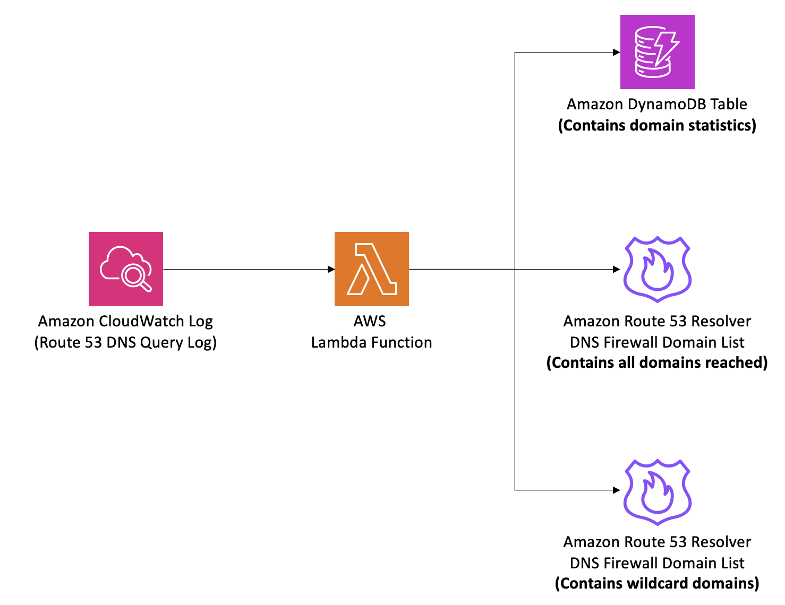

# Amazon Route 53 Resolver DNS Firewall Allow List Automation

This repository contains an AWS CloudFormation template that helps automate the allow list creation process for Amazon Route 53 Resolver DNS Firewall based on Route 53 query logs. The stack provisions the necessary resources to generate an allow list of domains based on Route 53 Resolver query logs stored in Amazon CloudWatch Logs, and populates a DynamoDB table with metrics such as domains being reached, unique client IP addresses / EC2 instance-ids reaching these domains, and total query count for each domain. The solution analyzes the Route 53 resolver query logss in Amazon CloudWatch Logs, identifies the domain, and adds it to the strict domain list. If a certain number of subdomains are reached (configurable via the `WildcardDomainMinimum` CloudFormation stack parameter) for the same domain, then that domain will be added to the wildcard domain list. 

This solution is intended to help with building an allow list-based architecture for controlling outbound DNS traffic from your workloads. It is not a fully automated solution, but rather a tool to surface the domains your workloads are resolving via DNS, which can then be used to build out allow list rules. While this solution does not provide a fully automated allow list configuration, it aims to simplify the process of building and maintaining an allow list by providing visibility into the domains being accessed and generating rules based on the observed traffic patterns.

This repository contains an AWS CloudFormation stack that automates the creation of an allow list for Amazon Route 53 Resolver DNS Firewall. The stack provisions the necessary resources to generate an allow list of domains based on DNS query logs in Amazon CloudWatch Logs, and populates a DynamoDB table with metrics such as domains being reached, unique client IP addresses / EC2 instance-ids reaching these domains, and total query count for each domain.

## Architecture

## Overview

The CloudFormation stack creates the following resources:

1. **Amazon Route 53 Resolver DNS Firewall Strict Domain List**: This domain list contains every specific domain that has been queried via the default VPC Route 53 Resolver. 
2. **Amazon Route 53 Resolver DNS Firewall Wildcard Domain List**: This domain list contains wildcard domains that have reached the configured threshold of subdomains (defined by the WildcardDomainMinimum parameter).
3. **Amazon DynamoDB Table**: Stores the domain names and associated metrics from the DNS query logs. (unique client IP addresses, instance-ids, number of requests to domain, number of unique workloads reaching the domain) 
4. **AWS Lambda Function**: Processes the DNS query logs and updates the DynamoDB table with domain names and metrics.
5. **Amazon CloudWatch Log Subscription Filter**: Sends DNS query logs to the Lambda function for processing (excluding predefined domains).

Note: This solution does not automatically attach the created domain lists to an Amazon Route 53 Resolver DNS Firewall rule group. It is up to the user to decide how they want to use the domain lists generated by this solution. The user is responsible for attaching the relevant DNS Firewall rule groups to their Amazon VPCs as needed.

## Before You Begin

The provided CloudFormation template assumes that you have already configured Amazon Route 53 resolver query logging to log DNS queries to a CloudWatch Logs log group. If you have not set up DNS query logging, you can follow the [Managing Resolver query logging configurations documentation](https://docs.aws.amazon.com/Route53/latest/DeveloperGuide/resolver-query-logging-configurations-managing.html) to enable it.

## Usage

1. Deploy the CloudFormation stack in your AWS account using the provided template.
2. Specify the required parameter during the stack deployment:
   - `DNSFirewallLogGroupName`: The name of the CloudWatch Logs log group containing your DNS query logs.
3. After successful deployment, the stack will start processing the DNS query logs and updating the DynamoDB table with domain names and metrics.
4. The Lambda function will automatically add new domain names to the Route 53 Resolver DNS Firewall allow list based on the data from the logs.

## Pricing Consideration

This solution leverages various AWS services, and you will be charged based on the usage of these services. The primary services involved and their pricing models are:

- **Amazon Route 53 Resolver DNS Firewall**: You are charged based on the number of DNS queries processed by the DNS Firewall and the number of domain names stored in the domain lists within the rule groups. Refer to the [Route 53 Resolver pricing](https://aws.amazon.com/route53/pricing/) page for more details.
- **AWS Lambda**: You are charged based on the number of requests and the duration of execution. Refer to the [Lambda pricing](https://aws.amazon.com/lambda/pricing/) page for more details.
- **Amazon DynamoDB**: You are charged based on the number of read and write requests, as well as the storage consumed by your data. Refer to the [DynamoDB pricing](https://aws.amazon.com/dynamodb/pricing/) page for more details.
- **Amazon CloudWatch Logs**: You are charged based on the ingestion, storage, and data scanning rates for your logs. Refer to the [CloudWatch Logs pricing](https://aws.amazon.com/cloudwatch/pricing/) page for more details.

It's recommended to estimate the expected costs based on your specific usage patterns and requirements before deploying this solution.

## Cleanup

To remove the resources created by this stack, delete the CloudFormation stack from the AWS Management Console or using the AWS CLI.

## License

This project is licensed under the [Apache-2.0 License](LICENSE).
